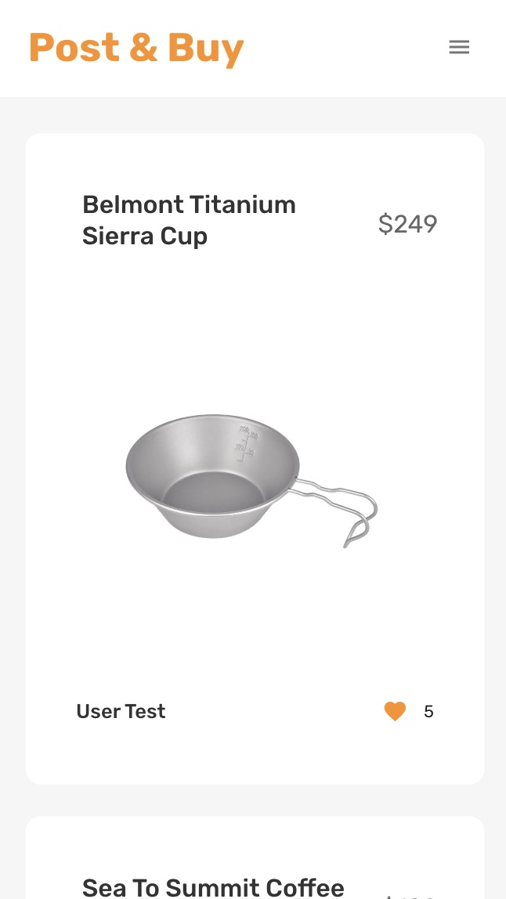
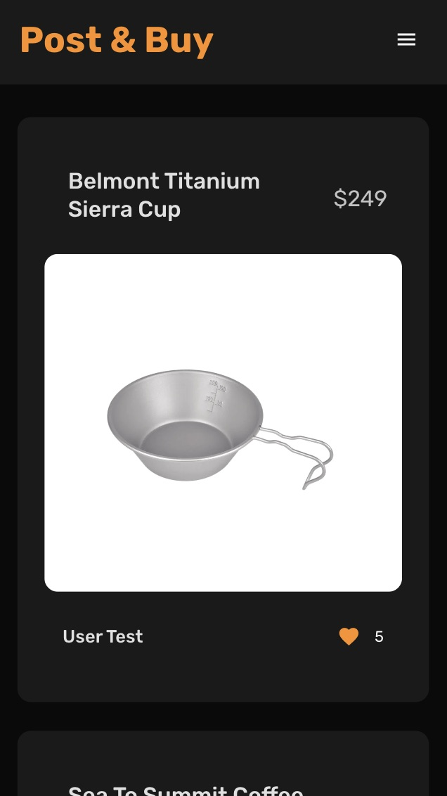
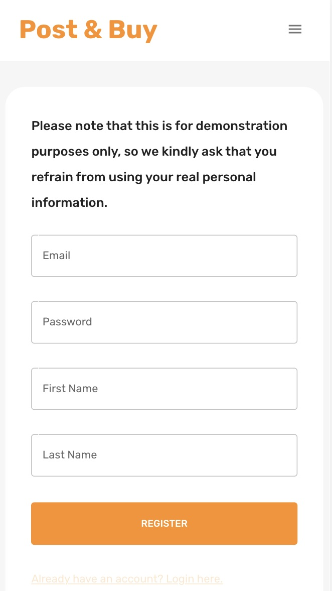
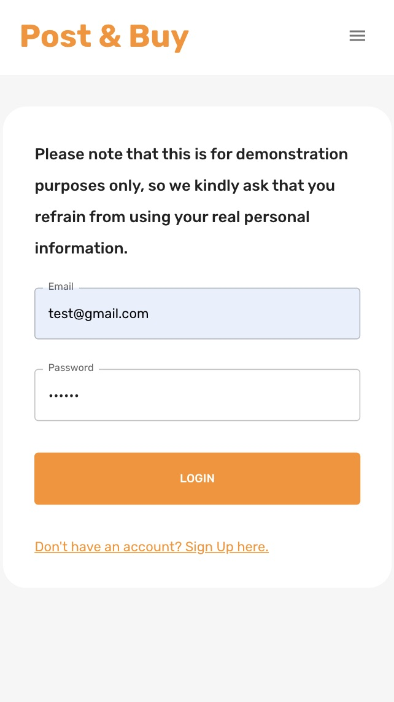
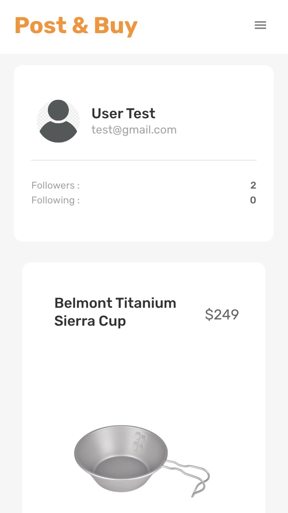
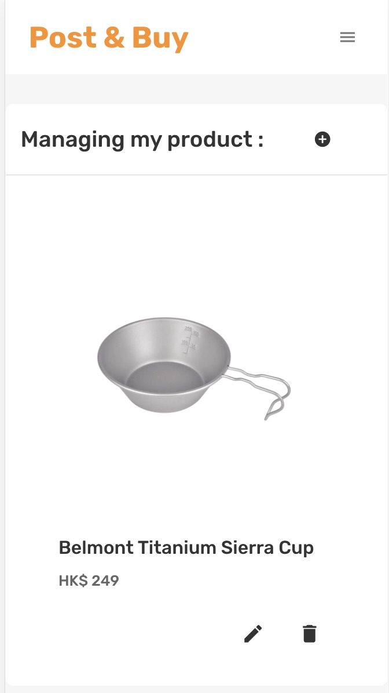
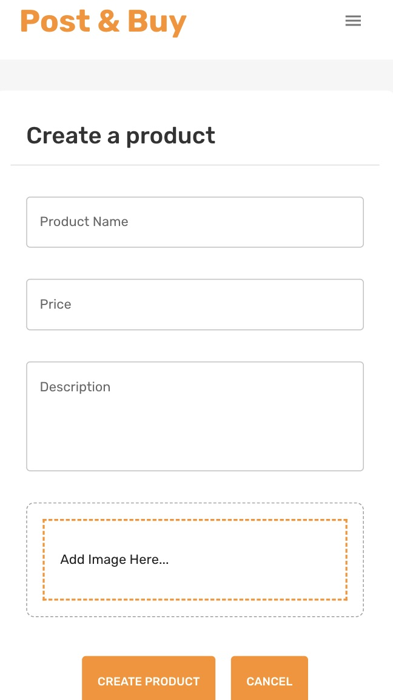
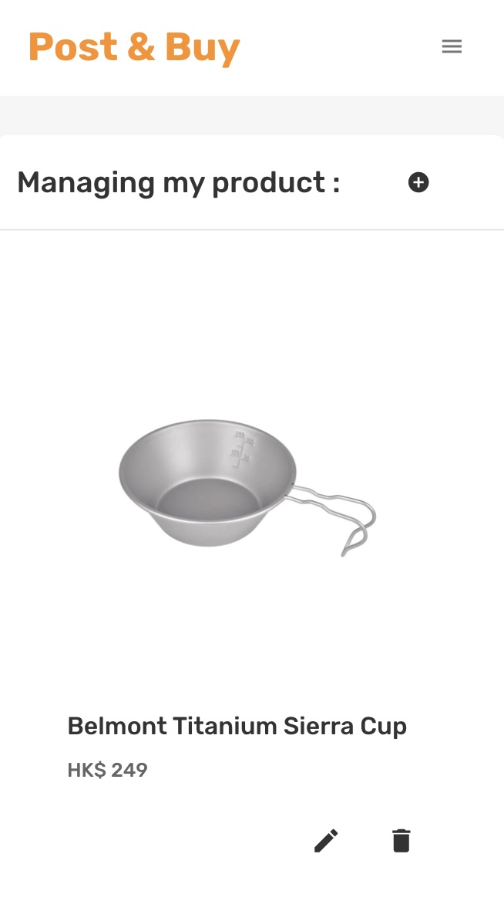
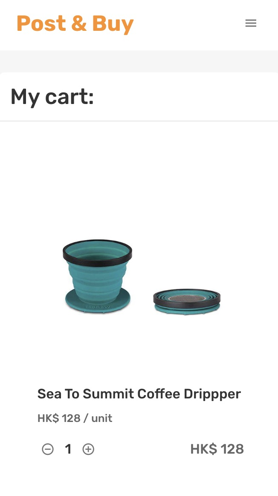
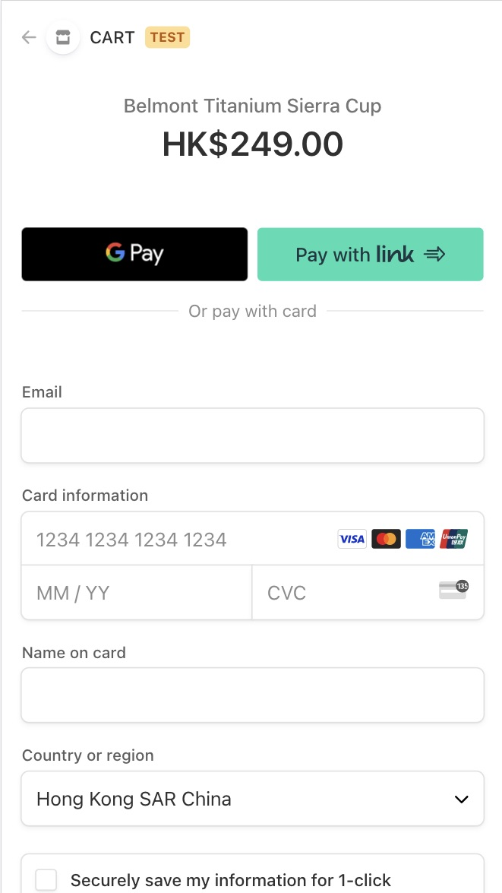

# E-commerce Website

> This is a FAKE e-commer website built on the MongoDB, Express, React, Node and deploy through [Netlify](https://www.netlify.com/) and [Render](https://dashboard.render.com/).

 

> Deploy to Production : [https://vanessa330ecommerce.netlify.app/](https://vanessa330ecommerce.netlify.app/)

 

Light Mode                 |  Dark Mode
:-------------------------:|:-------------------------:
  |  

 

Register                   |  Login
:-------------------------:|:-------------------------:
  |  

 

ProfilePage                |  ManagePage
:-------------------------:|:-------------------------:
  |  

 

CreateProduct              |  EditProduct
:-------------------------:|:-------------------------:
  |  

 

CartPage                   |  Checkout
:-------------------------:|:-------------------------:
  |  

## Frontend - Client Side

- React
- Library
   - react-dropzone
   - react-router-dom
   - react-redux
   - reduxjs/toolkit
   - redux-persist
   - dotenv
   - formik yup 
   - mui/material mui/icons-material

 

## Backend - Server Side

- Express
- Library
   - mongoose
   - bcrypt
   - jsonwebtoken
   - dotenv
   - cors
   - helmet
   - morgan
   - multer
   - stripe payment
- MongoDB