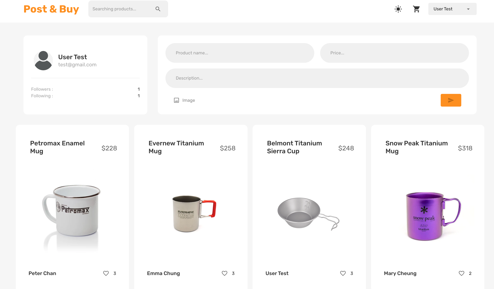
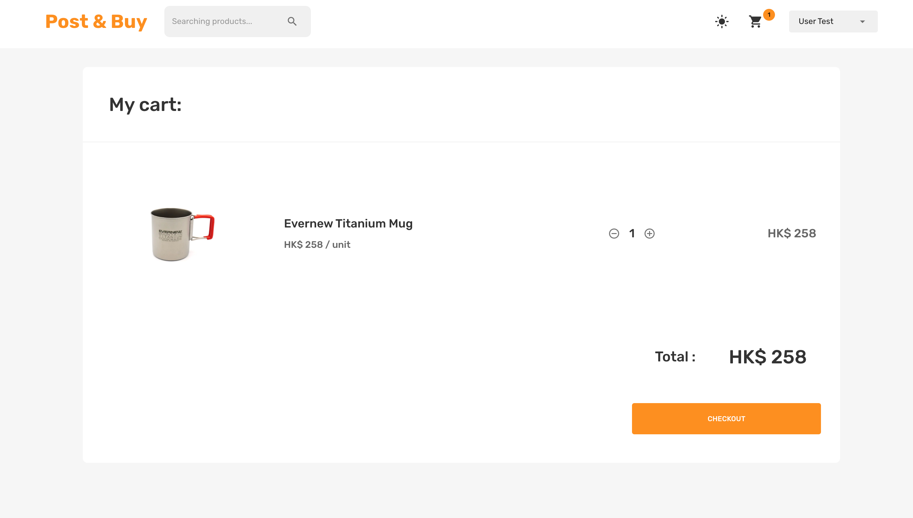

# E-commerce Website

> This is a FAKE shopping cart built on the MongoDB, Express, React, Node and deploy through [Cloudflare](https://www.cloudflare.com/) and [Render](https://dashboard.render.com/). You can register and log in, create your own products, and sell them too the other users. Also, you can add the product to your shopping cart.

 

> Deploy to Production : [https://ecommerce-8t6.pages.dev/](https://ecommerce-8t6.pages.dev/)

 

 

 

## Frontend - Client Side

1. Fronend Set Up
   - React app
   - Library
      - react-router-dom
      - react-redux
      - reduxjs/toolkit
      - redux-persist
      - react-dropzone
      - dotenv
      - formik yup 
      - mui/material mui/icons-material
2. Configuration on index.js
   - Login Redux Persist
3. Configuration on App.js
   - browser routers
4. Redux for state setting
5. UI
   - Theme
   - Navbar
      - DarkLight mode
      - Searchbar
      - ShoppingCart
      - User Login & Logout
   - HomePage
     - LoginPage
      - UserWidget
      - CreateWidget
     - ProductsWidget
   - ProfilePage
     - UserWidget
     - ProductsWidget
   - ProductInfoPage
      - UserWidget
      - ProductWidget
   - CartPage
      - CartItem

 

## Backend - Server Side

1. Backend installation
   - Express
   - MongoDB
   - Library
      - mongoose
      - bcrypt
      - jsonwebtoken
      - dotenv
      - cors
      - helmet
      - morgan
      - multer
      - stripe payment
2. Configuration on index.js
   - File storage
   - Routes settings
   - Connect to the database
3. User & Product models
4. Routes
   - auth controllers
     - Authentication: Register
     - Authorization: Login
     - verifyToken middleware
   - user controllers
     - getUser
     - getUserFollowers
     - getUserFollowing
     - addRemoveFollowing
   - prodcut controllers
     - createProdcut
     - getProducts
     - getUserProducts
     - likeProdcut
   - cart controllers
      - addItemToCart
      - getCart
      - subtractItem